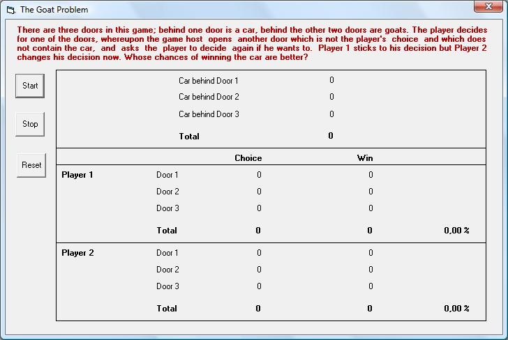



## Statitistical Chance Evaluation of Monty Hall's TV show "Lets make a Deal"\.

### Description

Suppose you're on a game show and you're given the choice of three doors. Behind one door is a car; behind the others are goats [that is, booby prizes]. The car and the goats were placed randomly behind the doors before the show. The rules of the game show are as follows: After you have chosen a door, the door remains closed for the time being. The game show host who knows what is behind the doors now opens one of the two remaining doors, and the door he opens must have a goat behind it. If both remaining doors have goats behind them, he chooses one randomly. After he opens a door with a goat, he will ask you to decide whether you want to stay with your first choice or to switch to the last remaining door. Imagine that you chose Door 1 and the host opens Door 3, which has a goat. He then asks you "Do you want to switch to Door Number 2?" Is it to your advantage to change your choice? ~~~ Note that the player may initially choose any of the three doors (not just Door 1), that the host opens a different door revealing a goat (not necessarily Door 3), and that he gives the player a second choice between the two remaining unopened doors. All situations with different door numbers form equivalent formulations of the problem and lead to the same conclusion.
 
### More Info
 

             |
---                |---
**Submitted On**   |2009-03-04 06:10:02
**By**             |[ULLI](https://github.com/Planet-Source-Code/PSCIndex/blob/master/ByAuthor/ulli.md)
**Level**          |Intermediate
**User Rating**    |5.0 (10 globes from 2 users)
**Compatibility**  |VB 6\.0
**Category**       |[Games](https://github.com/Planet-Source-Code/PSCIndex/blob/master/ByCategory/games__1-38.md)
**World**          |[Visual Basic](https://github.com/Planet-Source-Code/PSCIndex/blob/master/ByWorld/visual-basic.md)
**Archive File**   |[Statitisti214583342009\.zip](https://github.com/Planet-Source-Code/ulli-statitistical-chance-evaluation-of-monty-hall-s-tv-show-lets-make-a-deal__1-71834/archive/master.zip)

